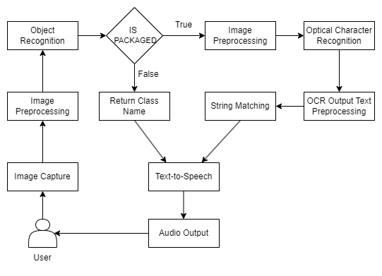

# ShopAssist: Grocery Product Recognition for the Visually Impaired

ShopAssist is a lightweight, mobile-friendly computer vision application designed to help visually impaired individuals identify grocery products in real-time. The system combines object detection and Optical Character Recognition (OCR) to detect, read, and recognize packaged items, delivering the product name via audio feedback — all without requiring an internet connection.

---

## Features

- Real-time object detection using **YOLOv5s**
- Multilingual OCR using **PaddleOCR**
- Intelligent string matching using fuzzy logic and cosine similarity
- Audio feedback via **Text-to-Speech**
- Optimized for **mobile and edge devices**
- Offline-capable

---

## System Architecture



---

## How It Works

### 1. **Object Detection**
- A YOLOv5s model trained on a custom grocery dataset detects objects in the scene.
- If the item is a **packaged product**, the detected region is cropped for OCR.

### 2. **OCR (PaddleOCR)**
- Text is extracted from the cropped region using PaddleOCR with multilingual support.
- Only high-confidence words (confidence > 0.7) are retained.

### 3. **Text Preprocessing**
- Removes noise (punctuation, short/irrelevant words)
- Converts text to lowercase
- De-duplicates words

### 4. **String Matching**
- Uses fuzzy matching (`rapidfuzz`) to align OCR words with known product keywords.
- Uses cosine similarity (`scikit-learn`) on TF-IDF vectors to find the **closest product match**.
- Products with similarity scores above a threshold are accepted (default: 20%).

### 5. **Audio Feedback**
- The matched product name is converted to speech and played back using Text-to-Speech.

---

## Results

| Component         | Metric                 | Result      |
|------------------|------------------------|-------------|
| Object Detection | mAP (YOLOv5s)          | 71.2%       |
| OCR              | Confidence Threshold   | > 70%       |
| Matching         | Cosine Similarity      | Adaptive (min 20%) |
| Feedback         | Response Time          | Real-time (avg <1s) |

---

## 📂 File Structure

```
├── main_shopAssist.ipynb     # Main notebook for inference and matching
├── yolov5/                   # Cloned YOLOv5 repo
├── models/                   # Trained YOLO weights
├── grocery_dataset/          # Custom dataset (images + labels)
├── inference/                # Images used for testing
├── README.md                 # Project overview
```

---

## ⚙️ Setup Instructions

### 1. Clone and Install Dependencies
```bash
git clone https://github.com/ultralytics/yolov5
pip install -r yolov5/requirements.txt
pip install paddleocr rapidfuzz scikit-learn gTTS opencv-python
```

### 2. Download Weights
Place your trained `best.pt` YOLO model in `models/`.

### 3. Run the Notebook
Run `main_shopAssist.ipynb` to:
- Detect products
- Extract and match text
- Get audio output

---

## Example Output

```plaintext
Cropped Image for: cereal_box
OCR Output: cheerios whole grain oats
Preprocessed OCR Output: cheerios whole grain oats
Best Fuzzy-Matched Reference: cheerios grain oats
Best Match: Cheerios Original Cereal 18oz
Similarity Score: 95.32%
```

---

## Mobile Optimization

- YOLOv5s is lightweight and mobile-deployable (convertible to TFLite/ONNX).
- PaddleOCR can be optimized using Paddle Lite or replaced with TFLite OCR models.
- Audio handled using mobile-native TTS APIs (e.g., Android’s `TextToSpeech`).

---

## 📁 Dataset

👉 [Download Dataset (Roboflow)](https://universe.roboflow.com/yolov5s-f0imc/shopassistod/dataset/1)

